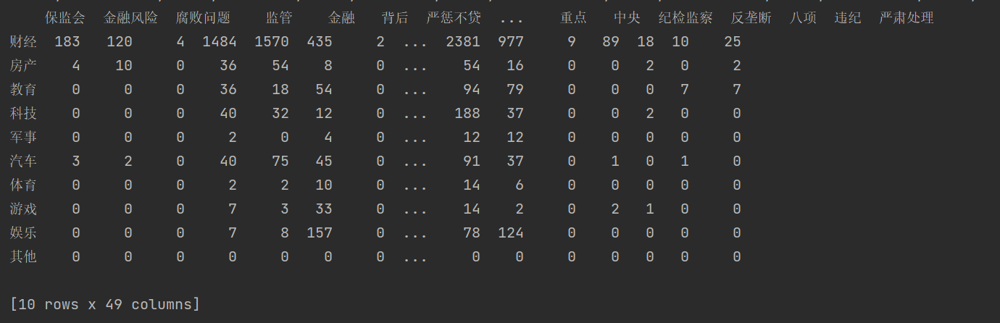

# 预处理

## 文本选择

总共可用类共9类（其他类无新闻）， 每类新闻随机抽取150篇

共计9*150篇新闻。

## 取词

通过TF-IDF算法，每篇新闻选取35个关键词。

**选词规则：**

TF(t)=该词出现次数/新闻词语总数

IDF(t)=log[(新闻总数/（1+出现该词新闻数）]；

取max(TF(t)*IDF(t))35

运用库：jieba.analyse

**词语过滤：**

去除关键词中禁用表中的词以及重复的词，最终获得关键词约15000

```python
#input:path
#output:content   
def keyword_cutting(path):
    content = []
    rbook = xlrd.open_workbook(path)
    jieba.analyse.set_stop_words('source/stop_words.txt')
    for i in range(0, len(rbook.sheets())):
        rsheet = rbook.sheet_by_index(i)
        for row in rsheet.get_rows():
            product_column = row[0]  # 品名所在的列
            product_value = product_column.value
            if product_value != 'content':
                tf_result = analyse.extract_tags(product_value, topK=50)
                tf_result = [w for w in tf_result if len(w) > 1
                             and not re.match('^[a-z|A-Z|0-9|.]*$', w)]
                content.append(tf_result)
return content
```

**词语相似值：**

基于哈工大同义词词林进行词语相似值计算

```python
#input (st1,st2)
#output similar_values

竞赛 的编码有： ['Hh07A01=']
比赛 的编码有： ['Hh07A01=']
竞赛 比赛 最终的相似度为 0.6899297856356673
```


# 特征工程

**特征矩阵构建：**

matrix[i]=type.num

matrix[j]=keyword.value




# 分类算法

## 基于朴素贝叶斯的原理

### 1. 提要

**先验概率**：  某个分类（c）在所有新闻中出现的概率

> p(c) = 某个分类的新闻数 / 总新闻数

**条件概率**： 在某个分类（c）下某个特征（f）出现的概率

> p(f/c) = 该词在该类出现的新闻数 / 该类所有的新闻数

### 2. 朴素贝叶斯的原理 

**P(c|f) = P(f|c) P(c) / P(f)**

由**贝叶斯定理**可得，现在的需求，求在某个特征（f）出现的情况下，又属于分类（c）的概率，就等于

> P(f|c) P(c) / P(f)

### 3. 变式

#### 3.1 存在多个特征并假设特征之间彼此独立，得

> P(f<sub>1</sub>|c)P(f<sub>2</sub>|c)...P(f<sub>n</sub>|c) P(c) / P(f)

#### 3.2 求概率 

因为P(f)在所有分类里相同，因此只需要求以下内容，就可得出现某特征（f）时，为分类（c）的概率

>P(f<sub>1</sub>|c)P(f<sub>2</sub>|c)...P(f<sub>n</sub>|c) P(c)

#### 3.3 比较概率大小

最后求出该特征在所有分类下的概率，通过比较彼此之间的概率，得出概率高的即最有可能是该分类；

> 注意：如果最后求出所有的分类的概率都小于某个值，可判定为其他类


## 分类器

# 测试结果

测试选择：每类新闻30篇共270篇

```python
f1_score=0.7153558052434457
```


# 不足之处以及设想改进

**1.特征矩阵数据量不够全面，特征矩阵特征值没有聚合**

设想改进：

  (1)增加新闻数选择，每类新闻随机抽取增至600篇，每篇新闻选取关键词30

  (2)进行特征值聚合

```python
content=['比赛','竞赛','战争','战役','增长','上升']
dict=content_resolve(content)
#output:[['比赛','竞赛'],['战争','战役'],['增长','上升']]
list1=['比赛','竞赛']
list2=...
...
matrix[j]=list.value
```

**2.f1_score低，计算概率公式存在问题，需进一步调参**

设想改进：

 对计算概率公式进行调参

引入文章标题特征矩阵，更新计算概率

**3.无法进行其他类判断，需进一步改进**

需要分析计算概率，概率值低于一个值，那么判断该新闻为其他类
